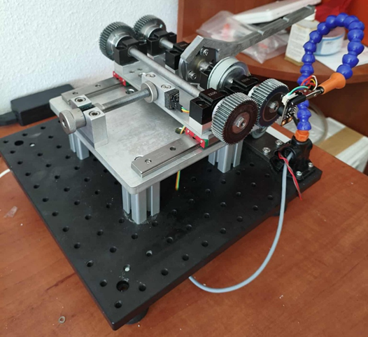

# Gear efficiency test rig

Custom research test rig designed to measure the efficiency of gear transmissions using the **power recirculation method**.

The system was designed and built as part of my engineering and master's research projects.

---

# Principle of operation

The test rig operates using the **power recirculation method**, commonly used in gear testing rigs such as the FZG test stand.

In this method two gear pairs form a **closed power loop**. Instead of applying load using a brake, the load is introduced by mechanically twisting a split shaft using a flange coupling.

This creates a circulating torque in the system while the drive motor only needs to compensate for mechanical losses.

Because of this, a relatively small motor can generate a much larger circulating power within the test loop.

Example operating conditions of the rig:

* motor power: 120 W
* circulating mechanical power: ~1.2 kW
* maximum motor torque: 1.5 Nm
* circulating torque in loop: up to ~15 Nm

---

# Measurement method

The total mechanical losses in the system are determined from the electrical power required to maintain constant rotational speed.

The motor torque and speed are measured through the motor controller.

Total loss power is given by

P_total = M_motor · ω_motor

To eliminate losses not related to gear load, a **two-stage measurement procedure** is used:

1. measurement with the coupling unloaded
2. measurement with circulating torque applied

This allows separating load-dependent losses from load-independent losses.

Load-dependent loss power is calculated as:

P_M = P_T1 − P_T2

where

P_T1 – total losses with torque applied
P_T2 – losses with no torque applied

Because the test rig contains two gear pairs, the loss is assumed to be equally distributed between them.

Gear efficiency is then calculated as

η = 1 − P_M / (2 · M_coupling · ω)

---

# Mechanical design

The mechanical structure consists of two parallel shafts:

* **drive shaft**
* **driven shaft**

Both shafts carry the tested gear wheels.

The drive shaft is split by a specially designed **flange coupling** which allows controlled torsional preload of the system.

By rotating the coupling halves relative to each other and locking them in place, a defined torque is introduced into the closed power loop.

The driven shaft is mounted on **linear positioning tables**, allowing precise adjustment of the center distance between the shafts.

This enables testing gears with different:

* pitch diameters
* face widths
* gear ratios

The modular design also allows testing other transmission types such as:

* timing belt drives
* pulley systems

---

# Measurement system

The test rig is equipped with sensors used to monitor operating conditions and collect experimental data.

### Temperature measurement

An **infrared pyrometer** is used to measure:

* tooth surface temperature
* ambient temperature

The sensor is mounted on an adjustable stand to ensure repeatable positioning.

### Acoustic monitoring

A **measurement microphone** records relative sound level changes during operation.

The microphone is not used for absolute sound pressure measurements but rather to detect changes in gear meshing conditions during testing.

### Motor controller data

A **Maxon EPOS4 motor controller** provides:

* motor current
* supply voltage
* rotational speed

These signals are used to determine the electrical input power required to compensate mechanical losses.

---

# Control and data acquisition

The test rig is controlled using software written in **LabVIEW**.

The program performs the following functions:

* motor speed control
* sensor data acquisition
* real-time monitoring of test parameters
* automatic data logging

Communication with the motor controller is handled using the **EPOS Command Library**.

Additional sensors are connected via an **Arduino MKR Zero microcontroller**, which communicates with the control software through a UART interface.

Data is sampled at **50 samples per second** and stored as CSV files for later analysis.

---

# Safety features

The control software includes automatic safety mechanisms.

The test is immediately stopped if:

* motor current exceeds allowed limits
* temperature exceeds safe limits
* communication errors occur

---

# Technical parameters

| Parameter                   | Value   |
| --------------------------- | ------- |
| Maximum shaft speed         | 750 rpm |
| Maximum motor torque        | 1.5 Nm  |
| Maximum circulating torque  | ~15 Nm  |
| Motor power                 | 120 W   |
| Estimated circulating power | ~1.2 kW |

These parameters allow testing of **small and medium power gear transmissions** under realistic operating loads.

---

# Prototype

The initial version of the test rig used keyed shaft connections with locking nuts.

Due to the small shaft diameters this solution proved inconvenient during frequent sample changes.

The design was later improved by using **set screws with shaft flats**, which simplified installation and improved repeatability.

The control system was also upgraded:

* the original data acquisition card was replaced with **Arduino MKR Zero**
* the motor is controlled by a **Maxon EPOS4 controller**
* mechanical overload clutch was replaced by electronic motor protection

---

# Validation

The test rig was validated using a steel gear pair manufactured from **C45 steel** (module 1, 48 teeth).

Efficiency measurements were performed for multiple combinations of:

* rotational speed
* torque
* lubrication conditions

The obtained efficiency trends matched typical gear efficiency characteristics reported in literature:

* efficiency increases with load
* efficiency decreases at high speed under dry conditions
* lubrication significantly improves efficiency

This confirms the correct operation of the test rig and its suitability for further experimental research.
