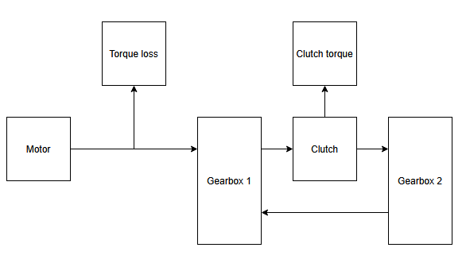
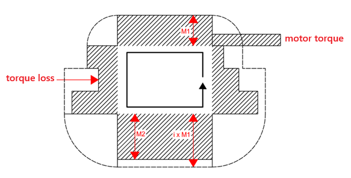
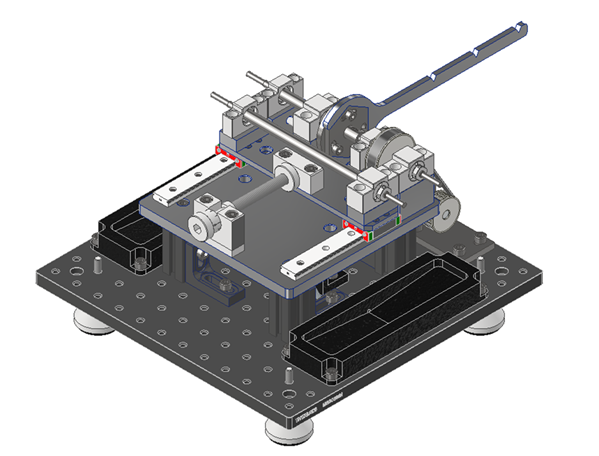
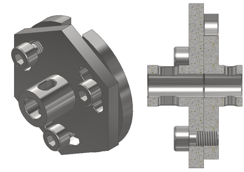
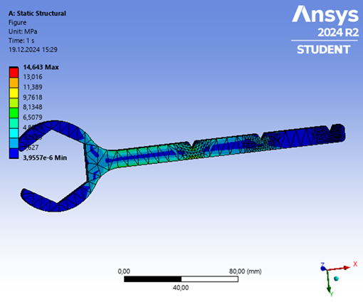
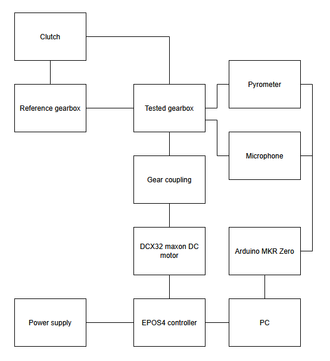
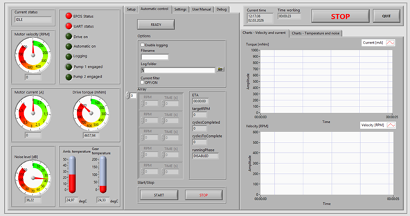
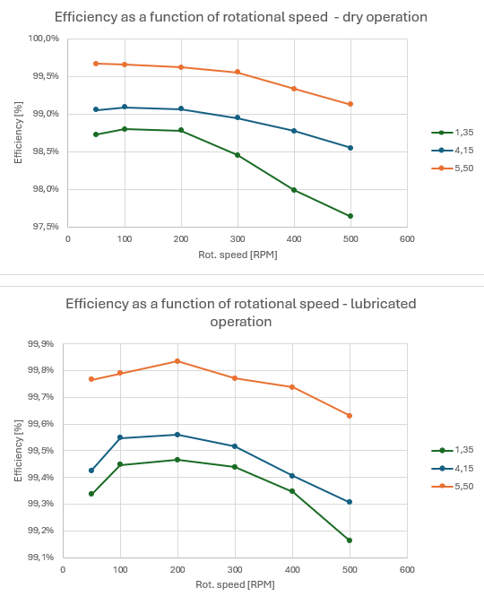

# Gear efficiency test rig

Custom research test rig designed to measure the efficiency of gear transmissions using the **power recirculation method**.

The system was designed and built as part of my engineering and master's research projects.
The rig allows testing gear transmissions under realistic loads while using a relatively low-power drive motor.

---

# Principle of operation



The test rig operates using the **power recirculation method**, a commonly used approach in gear testing machines such as FZG rigs.

Instead of applying load using a brake, the system forms a **closed mechanical power loop** using two gear pairs mounted on parallel shafts.

One of the shafts is split by a special **flange coupling** that allows controlled torsional preload to be introduced into the loop.

By twisting the coupling halves relative to each other, a circulating torque is generated in the drivetrain.

The drive motor then supplies only the energy required to compensate for mechanical losses in the system, such as:

* gear mesh friction
* bearing losses
* seal friction
* aerodynamic losses

Because of this principle, a relatively small motor can generate a much larger circulating power within the test loop.

Example operating parameters:

| Parameter                   | Value   |
| --------------------------- | ------- |
| Motor power                 | 120 W   |
| Motor torque                | 1.5 Nm  |
| Maximum circulating torque  | ~15 Nm  |
| Estimated circulating power | ~1.2 kW |

---

# Measurement method



Mechanical losses are determined from the power required to maintain constant rotational speed.

Total loss power is calculated from motor torque and speed:

```text
P_total = M_motor · ω_motor
```

To eliminate losses not related to gear load, a **two-stage measurement procedure** is used.

1. Measurement with the coupling unloaded
2. Measurement with circulating torque applied

This yields two values:

```text
P_T1 = P_M + P_S
P_T2 ≈ P_S
```

where

* **P_M** – load-dependent losses
* **P_S** – load-independent losses

Load-dependent losses are obtained as:

```text
P_M = P_T1 − P_T2
```

Because the system contains two identical gear pairs, losses are assumed to be evenly distributed.

Gear efficiency is therefore calculated as:

```text
η = 1 − P_M / (2 · M_sprz · ω)
```

where

* **M_sprz** – torque introduced by the coupling
* **ω** – shaft angular velocity

---

# Mechanical design



The rig consists of two parallel shafts:

* **drive shaft**
* **driven shaft**

Both shafts carry the tested gears.

The driven shaft is mounted on **linear positioning stages**, allowing adjustment of the center distance between shafts.

The position is controlled using an **M10 lead screw**, enabling center distance adjustment with approximately:

```text
0.05 mm resolution
```

This allows accurate control of gear meshing conditions and easy adaptation of the rig to gears with different:

* pitch diameters
* face widths
* gear ratios

Gear replacement typically requires approximately **5 minutes**.

The rig frame is constructed from a combination of:

* aluminium structural profiles
* machined aluminium components

---

# Torque loading mechanism



Torque in the circulating loop is introduced using a **split shaft flange coupling**.

The coupling consists of two flanges connected by **three clamping bolts**.

A lever arm attached to the coupling allows torsional preload to be applied using calibrated weights.

Available lever arm radii:

* 200 mm
* 150 mm
* 100 mm

Torque is determined from the applied mass:

```text
M_sprz = m · g · r
```

where

* **m** – applied mass
* **g** – gravitational acceleration
* **r** – lever arm length

This simple mechanism allows repeatable torque loading without requiring an expensive torque sensor.

---

---

# Finite element analysis of the loading lever



To verify the mechanical strength of the torque loading lever, a **finite element analysis (FEA)** was performed using **ANSYS Static Structural**.

The analysis evaluated the stress distribution in the lever when subjected to the maximum expected loading torque.

### Boundary conditions

The simulation assumed:

- the hexagonal opening constrained to represent attachment to the coupling
- force applied at the end of the lever corresponding to the maximum calibration mass
- lever arm length of 200 mm

The applied force corresponds to the maximum expected loading torque generated by the mass used during experiments (10 Nm).

### Results

The maximum equivalent stress obtained in the simulation was approximately:

```text
σ_max ≈ 14.6 MPa
```
This value is significantly below the yield strength of the aluminium alloy used for the lever, providing a large safety margin.

The stress distribution indicates that the highest stresses occur near the transition between the lever arm and the hexagonal coupling interface, which is consistent with the expected bending load case.

Conclusion

The analysis confirms that the lever design provides sufficient structural strength for the intended operating conditions while maintaining low mass and simple manufacturability.

# Drive system

The rig is driven by a **Maxon DCX32 DC motor** equipped with a **GPX32 planetary gearbox**.

Motor gearbox ratio:

```text
5.3 : 1
```

The motor drives the test rig through an additional **belt transmission** with ratio:

```text
1.5 : 1
```

The belt stage also serves as a **compliant coupling**, reducing sensitivity to misalignment and damping vibrations in the drivetrain.

---

# Gear mounting

The initial design used **keyed shaft connections with locking nuts**.

Due to the small shaft diameters this approach proved inconvenient during frequent gear changes.

The final design uses **set screws engaging with flats on the shafts**, which simplifies installation while maintaining sufficient torque transmission.

Gear installation typically takes **about 5 minutes**.

---

# Lubrication

The rig supports two operating modes:

* **dry operation**
* **grease lubrication**

Because of the open structure of the test rig, operation in an oil bath is not possible.

Instead, lubrication tests are performed using **high-viscosity grease applied directly to the gear teeth**.

---

# Measurement system



The test rig is equipped with several sensors used to monitor operating conditions.

### Temperature measurement

An **infrared pyrometer** measures:

* tooth surface temperature
* ambient temperature

The sensor is mounted on an adjustable stand for repeatable positioning.

### Acoustic monitoring

A **measurement microphone** records relative changes in sound level during operation.

The microphone is used only to observe **relative changes in gear noise**, not absolute sound pressure levels.

### Motor controller measurements

A **Maxon EPOS4 motor controller** provides measurements of:

* motor current
* supply voltage
* rotational speed

These values are used to estimate the mechanical losses in the system.

---

# Control and data acquisition



The test rig is controlled using software written in **LabVIEW**.

The control software performs:

* motor speed control
* sensor data acquisition
* real-time monitoring
* signal filtering
* automatic data logging

Sensor data from the pyrometer and microphone are acquired using an **Arduino MKR Zero microcontroller**.

The Arduino performs **data acquisition only**, while all processing is performed on the host computer.

Sampling frequency:

```text
50 samples per second
```

Each measurement run is saved as a **CSV file** for later analysis.

The system supports **automated test sequences**, allowing measurements at multiple speeds to be performed automatically.

---

# Safety features

The control software includes automatic safety mechanisms.

The test is stopped if:

* motor current exceeds safe limits
* temperature exceeds allowed limits
* communication errors occur

---

# Validation



The test rig was validated using a steel gear pair manufactured from **C45 steel**.

Gear parameters:

* module: 1
* number of teeth: 48

Measurements were performed for different combinations of:

* rotational speed
* load torque
* lubrication conditions

Observed trends matched those reported in literature:

* efficiency increases with load
* efficiency decreases at high speed in dry operation
* lubrication improves efficiency

These results confirm correct operation of the test rig.

---

# Engineering challenges

The most significant engineering challenge during the development of the rig was **obtaining reliable torque measurements**.

A direct rotary torque sensor would significantly simplify the system but was beyond the project budget.

Instead, torque estimation based on **motor current and motor torque constant** was implemented.

---

# Future improvements

Several improvements have been identified for future versions of the rig:

* larger shaft diameters to reduce torsional compliance
* higher torque capacity
* improved shaft connections using keyed joints
* increased mechanical stiffness of the drivetrain
